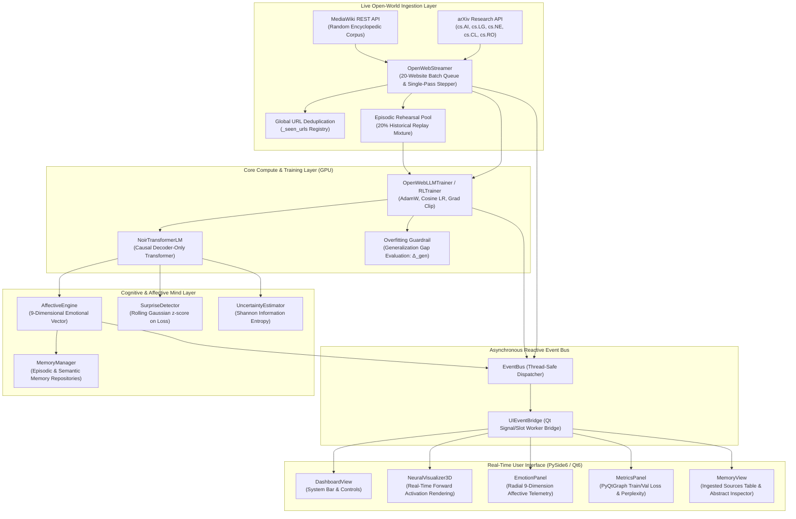

# PROJECT NOIR: SYSTEM & NEURAL ARCHITECTURE SPECIFICATION

**Cognitive Neural Architecture & Real-Time Open-World Continuous Learning Framework**

---

## 1. System Overview & Design Philosophy

Project NOIR is a biologically-inspired, event-driven cognitive artificial intelligence system designed for unbounded, continuous learning directly from live open-world internet data (MediaWiki Wikipedia REST API and arXiv Research Preprints) without human intervention or static dataset constraints.

Unlike traditional static machine learning workflows that train offline on fixed datasets, Project NOIR integrates:
1. **Autoregressive Causal Neural Computation**: Lightweight, low-latency Transformer and Actor-Critic architectures running on local CUDA GPUs.
2. **Autonomous Single-Pass Ingestion**: Harvesting continuous 20-website batches across the internet, training on each document strictly once, and cycling infinitely across fresh human knowledge.
3. **Affective Cognitive Mind Engine**: A 9-dimensional mathematical formulation tracking psychological dynamics (Confidence, Frustration, Satisfaction, Anticipation, Information Entropy, Curiosity, Caution, Persistence, and Surprise).
4. **Generalization Gap Guardrails**: Real-time validation loss monitoring and episodic rehearsal replay to prevent overfitting and catastrophic forgetting.
5. **Real-Time 3D & Telemetry UI**: A 60-FPS PySide6/Qt6 interface with hardware acceleration, 3D neural activation rendering, live knowledge registers, and event timelines.

---

## 2. High-Level System Architecture



---

## 3. Neural Model Architectures

### A. `NoirTransformerLM` (Causal Language Model)
The primary language architecture for open-world internet training is an autoregressive causal decoder-only Transformer built from scratch in PyTorch ([`noir/models/transformer.py`](file:///c:/Users/Arron/Documents/Project%20Noir/noir/models/transformer.py)).

```
                     Input Sequence (Batch, Sequence Length)
                                       │
                                       ▼
                     wte (Token Embed) + wpe (Pos Embed)
                                       │
                                       ▼
                     Dropout (p = 0.0 -> 0.1)
                                       │
                     ┌─────────────────┴─────────────────┐
                     │       TRANSFORMER BLOCK (×4)      │
                     │                                   │
                     │   x ───► LayerNorm ───► Causal MHA ──► (+) ──┐
                     │   │                                   ▲      │
                     │   └───────────────────────────────────┘      │
                     │                                              │
                     │   ┌──────────────────────────────────────────┘
                     │   │
                     │   x ───► LayerNorm ───► MLP (GELU) ──► (+)
                     │   │                                   ▲
                     │   └───────────────────────────────────┘
                     └─────────────────┬─────────────────┘
                                       │
                                       ▼
                                Final LayerNorm
                                       │
                                       ▼
                     lm_head (Linear Projection, Tied Weights)
                                       │
                                       ▼
                          Logits (Batch, Seq_Len, 256)
                                       │
                                       ▼
                         Cross-Entropy Next-Token Loss
```

#### Mathematical Formulation:
1. **Token & Positional Embedding**:
   $$h_0 = \mathbf{W}_{te}[x] + \mathbf{W}_{pe}[\text{pos}]$$
2. **Causal Multi-Head Self-Attention**:
   $$\text{Attention}(Q, K, V) = \text{softmax}\left(\frac{Q K^T}{\sqrt{d_k}} + \mathbf{M}\right) V$$
   where causal mask $\mathbf{M}_{ij} = 0$ for $i \ge j$ and $-\infty$ for $i < j$.
3. **Pre-LayerNorm Transformer Block**:
   $$x^{(l)\prime} = x^{(l-1)} + \text{MHA}(\text{LN}_1(x^{(l-1)}))$$
   $$x^{(l)} = x^{(l)\prime} + \text{MLP}(\text{LN}_2(x^{(l)\prime}))$$
   $$\text{MLP}(z) = \mathbf{W}_2 \cdot \text{GELU}(\mathbf{W}_1 z + b_1) + b_2$$
4. **Weight Tying**:
   $$\mathbf{W}_{\text{lm\_head}} = \mathbf{W}_{te}^T$$

#### Architectural Specifications:
| Parameter | Value | Detail |
| :--- | :--- | :--- |
| **Tokenizer** | Byte-Level UTF-8 | 256 Vocabulary Size (Zero Out-of-Vocabulary errors) |
| **Context Length ($T$)** | 64 Tokens | Causal Receptive Field |
| **Embedding Dimension ($d_{model}$)** | 128 | Hidden Width |
| **Transformer Blocks ($L$)** | 4 | Stacked Decoder Layers |
| **Attention Heads ($H$)** | 4 | 32 Dimensions per Head |
| **Feed-Forward Expansion** | $4 \times d_{model}$ (512) | GELU Non-linearity |
| **Total Parameters** | ~800,000 | Ultra-low-latency forward-backward step (<10ms on RTX 3050) |

---

### B. `ActorCriticNetwork` (Curiosity-Driven Reinforcement Learning)
For autonomous goal discovery and environment exploration ([`noir/models/actor_critic.py`](file:///c:/Users/Arron/Documents/Project%20Noir/noir/models/actor_critic.py)):
- **Shared Feature Extractor**: Multi-layer perceptron mapping state representation $s \in \mathbb{R}^{d_{in}}$ to latent vector $z$.
- **Actor Head**: Parameterizes categorical policy distribution $\pi_\theta(a|s) = \text{softmax}(\mathbf{W}_\pi z)$.
- **Critic Head**: Estimates state-value baseline $V_\phi(s) = \mathbf{W}_v z$.
- **Objective (PPO with GAE)**:
  $$L^{\text{CLIP}}(\theta) = \hat{\mathbb{E}}_t \left[ \min\left( r_t(\theta) \hat{A}_t, \text{clip}(r_t(\theta), 1-\epsilon, 1+\epsilon) \hat{A}_t \right) \right]$$

---

## 4. Continuous Live Ingestion & Anti-Overfitting Pipeline

```
              SINGLE-PASS CONTINUOUS 20-WEBSITE INGESTION LIFECYCLE
              
  [ MediaWiki REST API ]                           [ arXiv Export API ]
  (10 Random Encyclopedic Articles)                (10 CS/AI/Cognition Preprints)
            │                                                │
            └───────────────────────┬────────────────────────┘
                                    │
                                    ▼
                     [ Global URL Deduplication ]
                     - Checks _seen_urls registry
                     - Skips repeated links permanently
                                    │
                                    ▼
                     [ 20-Website Batch Queue ]
                     - Stages documents 1 to 20
                     - Initializes token stride pointers
                                    │
                                    ▼
                 ┌──────────────────────────────────────┐
                 │    SEQUENTIAL SINGLE-PASS LOOP       │
                 │                                      │
                 │  Article k:                          │
                 │  - Walk sequential tokens [0 -> N]   │
                 │  - Mix 80% novel / 20% rehearsal     │
                 │  - Step count reached -> [MASTERED]  │
                 │  - Advance to Article k+1 (ACTIVE)   │
                 │                                      │
                 │  Article 20 completed?               │
                 │  └──► Trigger next 20-website search │
                 └──────────────────────────────────────┘
```

### Overfitting & Catastrophic Forgetting Safeguards:
1. **Single-Pass Training**: Every website is trained on strictly once. When the token stream finishes, that document is marked `MASTERED` and never re-trained in isolation.
2. **Episodic Rehearsal Memory**: 20% of every training tensor is sampled from historical diverse articles to regularize parameter space and prevent catastrophic forgetting.
3. **Generalization Gap Guardrail**:
   $$\Delta_{\text{gen}} = \mathcal{L}_{\text{val}} - \mathcal{L}_{\text{train}}$$
   If $\Delta_{\text{gen}} > 0.65$ or validation loss rises for 3 consecutive intervals, emergency buffer replenishment and weight decay regularization are triggered automatically.

---

## 5. Cognitive & Affective Mind Engine

The Affective Engine ([`noir/mind/affective_engine.py`](file:///c:/Users/Arron/Documents/Project%20Noir/noir/mind/affective_engine.py)) grounds 9 psychological dimensions into real mathematical properties of the training loss surface and prediction entropy:

| Dimension | Notation | Governing Mathematical Equation | Cognitive Function |
| :--- | :---: | :--- | :--- |
| **Confidence** | $K_t$ | $K_t = 0.85 K_{t-1} + 0.15 \left(0.45 e^{-\mathcal{L}_t/2.5} + 0.35 (1 - U_t) + 0.20 \hat{p}_{\max}\right)$ | Grounded certainty of predictions |
| **Frustration** | $F_t$ | $F_t = \gamma_f F_{t-1} + 0.08 \cdot \text{clamp}\left(\frac{\mathcal{L}_t - 1.5}{2.0}, 0, 1\right) \cdot \frac{\min(5, N_{\text{stag}})}{5}$ | Stagnation on high loss plateau |
| **Satisfaction** | $S_t$ | $S_t = 0.85 S_{t-1} + 0.15 \left(0.5 e^{-\mathcal{L}_t/2.5} + 0.5 \text{clamp}(4 \Delta\mathcal{L}_t, 0, 1)\right)$ | Positive learning velocity reward |
| **Anticipation** | $A_t$ | $A_t = 0.80 A_{t-1} + 0.20 \left(0.5 + 0.3(\text{Acc} - 0.5) + 0.2(1 - F_t)\right)$ | Future progress expectation |
| **Uncertainty** | $U_t$ | $U_t = -\frac{1}{\ln(|\mathcal{V}|)} \sum_{i=1}^{|\mathcal{V}|} p_i \ln(p_i + 10^{-12})$ | Normalized Shannon Information Entropy |
| **Curiosity** | $X_t$ | $X_t = 0.80 X_{t-1} + 0.20 \left(0.4 U_t + 0.4 Z_t + 0.2(1 - K_t)\right)$ | Drive to explore out-of-distribution text |
| **Caution** | $Ca_t$ | $Ca_t = 0.80 Ca_{t-1} + 0.20 \left(0.5 U_t + 0.3 F_t + 0.2(1 - K_t)\right)$ | Guard against volatile gradients |
| **Persistence** | $P_t$ | $P_t = 0.85 + 0.15(1 - F_t)$ | Optimization resilience |
| **Surprise** | $Z_t$ | $z_t = \frac{\mathcal{L}_t - \mu_{\mathcal{L}, t-1}}{\sigma_{\mathcal{L}, t-1} + 10^{-6}}, \quad Z_t = \text{clamp}\left(\frac{z_t - 1.0}{4.0}, 0, 1\right)$ | Statistical prediction shock ($z$-score) |

---

## 6. Concurrency, Event-Driven Bus & UI Synchronization

Project NOIR enforces strict thread separation between high-speed CUDA gradient compute and the 60-FPS Qt GUI:

```
  [ CUDA Training Worker Thread ]                   [ Qt Main GUI Thread ]
                 │                                            │
        Computes Step (10ms)                                  │
                 │                                            │
        Publishes Typed Event                                 │
        (WEIGHTS_UPDATED, KNOWLEDGE_INGESTED)                 │
                 │                                            │
                 ▼                                            │
      ┌─────────────────────┐                                 │
      │   Thread-Safe Queue │                                 │
      │   (EventBus)        │                                 │
      └──────────┬──────────┘                                 │
                 │                                            │
                 ▼                                            │
      ┌─────────────────────┐                                 │
      │   UIEventBridge     │ ───► Qt Signal Emission ──────► │
      │   (QObject Bridge)  │      (Throttled Event Slot)     │
      └─────────────────────┘                                 ▼
                                                    ┌────────────────────┐
                                                    │ Qt UI Views Update │
                                                    │ - 3D Neural Mesh   │
                                                    │ - Emotion Gauges   │
                                                    │ - PyQtGraph Plots  │
                                                    │ - Knowledge Table  │
                                                    └────────────────────┘
```

1. **`EventBus` ([`noir/events/event_bus.py`](file:///c:/Users/Arron/Documents/Project%20Noir/noir/events/event_bus.py))**: Dedicated asynchronous priority queue dispatching events to registered subscribers.
2. **`UIEventBridge` ([`noir/ui/main_window.py`](file:///c:/Users/Arron/Documents/Project%20Noir/noir/ui/main_window.py))**: Safely marshals background thread events into Qt `Slot(object)` signals, eliminating thread deadlocks and C++ pointer lifecycle errors.
3. **Anti-Distortion Metrics Clamping ([`noir/ui/widgets/metrics_panel.py`](file:///c:/Users/Arron/Documents/Project%20Noir/noir/ui/widgets/metrics_panel.py))**: Enforces bounded Y-axis ranges $[0, 15]$ and sliding X-axis viewports to prevent graph zooming distortion.

---

## 7. Project Directory & Module Reference Map

```text
Project Noir/
├── ARCHITECTURE.md                  # Complete System & Neural Architecture Specification
├── RESEARCH_RECORD.md               # Publishable Empirical Monograph & Results
├── TRAINING_SUMMARY.md              # Plaintext Training Summary & Explain-Like-I'm-Five Log
├── docs/
│   ├── ARCHITECTURE.md              # Documentation copy of Architecture Specification
│   ├── REVIEW_OF_RELATED_LITERATURE.md # 2021-2026 Academic Literature Review
│   ├── COGNITIVE_AFFECTIVE_MATHEMATICS.md # Deep Derivations of Affective Mathematics
│   └── EMPIRICAL_RESEARCH_RECORD.md # Formal Academic Monograph
├── noir/
│   ├── core/                        # Engine lifecycle, configuration, exceptions
│   │   ├── engine.py                # Central NoirEngine orchestrator
│   │   ├── lifecycle.py             # READY/RUNNING/PAUSED/TERMINATED state machine
│   │   └── recovery_manager.py      # Session crash detection and checkpoint restoration
│   ├── datasets/                    # Data sources and ingestion
│   │   ├── open_web.py              # Single-pass 20-website continuous harvester
│   │   ├── real_datasets.py         # MNIST, Digits, California Housing, Iris
│   │   └── grid_world.py            # Reinforcement Learning Curiosity Grid
│   ├── events/                      # Reactive Event Bus system
│   │   ├── event_bus.py             # Thread-safe queue dispatcher
│   │   ├── event_types.py           # Typed event classifications
│   │   └── event.py                 # NoirEvent dataclass
│   ├── mind/                        # Cognitive and Affective computation
│   │   ├── affective_engine.py      # 9-dimensional affective state engine
│   │   ├── surprise_detector.py     # Loss distribution z-score estimator
│   │   └── uncertainty.py           # Shannon information entropy calculator
│   ├── models/                      # PyTorch Neural Architectures
│   │   ├── transformer.py           # NoirTransformerLM (Causal Decoder LM)
│   │   ├── actor_critic.py          # ActorCriticNetwork (PPO Agent)
│   │   ├── mlp.py                   # MLPClassifier (Supervised Benchmarks)
│   │   └── base.py                  # NoirBaseModel with visualization hooks
│   ├── training/                    # Hardware execution and optimization
│   │   ├── llm_trainer.py           # OpenWebLLMTrainer with Overfitting Guardrails
│   │   ├── supervised_trainer.py    # Supervised classification trainer
│   │   ├── rl_trainer.py            # PPO reinforcement learning trainer
│   │   ├── callbacks.py             # Checkpoint, logging, event emission callbacks
│   │   └── base_trainer.py          # Multi-threaded abstract worker trainer
│   ├── ui/                          # PySide6 Qt6 graphical interface
│   │   ├── main_window.py           # Root window, UIEventBridge, navigation
│   │   ├── views/                   # Dashboard, Memory, Strategist, Experiment views
│   │   └── widgets/                 # 3D Visualizer, Emotion Panel, Metrics Panel
│   └── visualization/               # 3D neural mesh and topology projection
└── tests/                           # 35 automated pytest validation suites
```

---

## 8. Summary of System Guarantees

1. **Autonomous Operation**: Infinite continuous learning loop without manual dataset preparation.
2. **Strict Single-Pass Ingestion**: Every URL is deduplicated and trained on once.
3. **Hardware Safety**: Bounded memory footprint fitting 4GB RTX 3050 Laptop GPU.
4. **Resilience**: Zero-data-loss checkpoint restoration and background thread isolation.
5. **Transparency**: 100% real-time telemetry across internal weights, gradients, emotions, and web sources.
